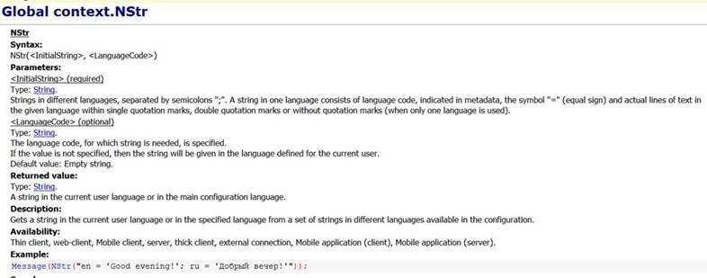

Дан входной файл (в аттаче) и синтаксис функции NStr:

Нужно написать программу, которая на основании приложенного файла генерирует текстовый файл, содержащий все строки, переданные в функцию NStr в следующем формате.

«Номер строки в файле» : «язык строки = language code» : «сама строка на указанном языке = actual lines of text»

Пример для первой строки из файла

730: en : EXTERNAL CONNECTION: %1

730: ru : ВНЕШНЕЕ СОЕДИНЕНИЕ: %1

730: vi : KẾT NỐI NGOÀI: %1

730: ro : CONEXIUNEA EXTERNĂ: %1'